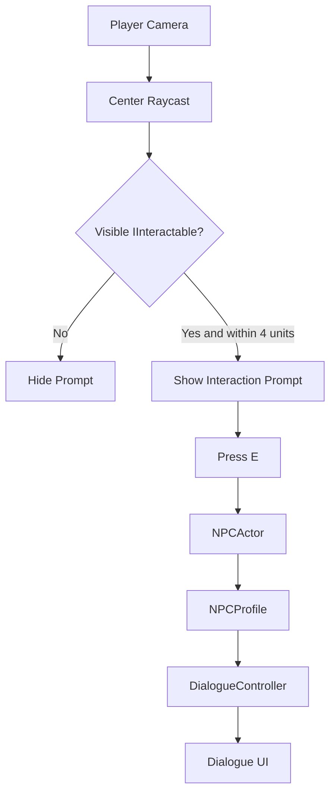
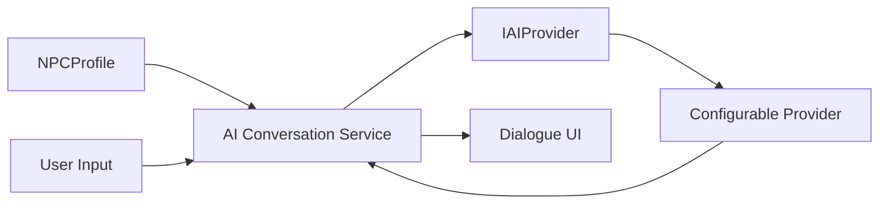
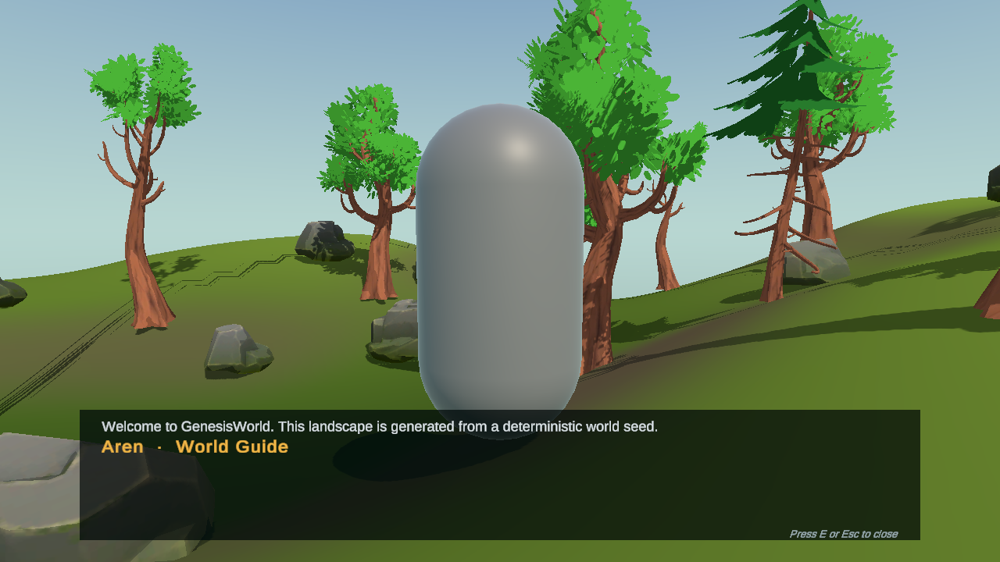

# AI and NPC Interaction

**English** | [简体中文](./AIAndNPC.zh-CN.md)

## Overview

GenesisWorld v0.4.0 begins with a deliberately local NPC interaction loop. Commit 15 connects player targeting, an authored NPC identity, and readable dialogue UI without networking or an external AI provider. This creates a testable gameplay boundary before provider integration begins.

## v0.4.0 Goals

- Establish a stable NPC domain model and interaction flow.
- Keep scene entities, profile data, player input, and UI responsibilities separate.
- Add a provider-independent conversation boundary in later commits.
- Integrate one configurable LLM provider only after that abstraction exists.

Commit 15 covers only the first two goals. It is an NPC interaction foundation, not an AI-powered NPC system.

## NPC Domain Model

An NPC is represented by persistent authored data plus a scene entity:

- [`NPCProfile`](../Assets/Scripts/NPC/NPCProfile.cs) owns stable identity and local dialogue data.
- [`NPCActor`](../Assets/Scripts/NPC/NPCActor.cs) binds one profile to a scene GameObject and exposes interaction behavior.

This separation lets future prompt context or memory evolve without turning the scene component into a data container or service manager.

## NPCProfile

`NPCProfile` is a `ScriptableObject` because identity data should be reusable, inspectable, and independent from scene instances. Its current fields are:

| Field | Guide NPC value |
|---|---|
| NPC Id | `npc_guide_001` |
| Display Name | `Aren` |
| Role | `World Guide` |
| Description | A guide who studies the generated landscape. |
| Greeting | Welcome to GenesisWorld. This landscape is generated from a deterministic world seed. |

The stable ID is authored rather than generated at runtime so later save data and memory can identify the same character.

## NPCActor

`NPCActor` implements the interaction contract and exposes profile values through safe fallbacks. It does not read player input, render UI, or know about a future AI provider. The scene-level Guide NPC uses a project-created capsule placeholder, a compact collider, and a one-time terrain ground snap; it is not spawned by `EnvironmentSpawner`.

## IInteractable

[`IInteractable`](../Assets/Scripts/Interaction/IInteractable.cs) is a small shared contract for a prompt, target transform, availability, and interaction entry point. It is sufficient for the current NPC while leaving room for later doors or inspectable objects without introducing a global interaction manager.

## Player Interaction Flow

[`PlayerInteractionController`](../Assets/Scripts/Interaction/PlayerInteractionController.cs) casts from the center of the third-person camera. It selects the closest visible collider, filters it through `IInteractable`, and checks distance to the hit collider surface. No per-frame scene-wide object search is used.

The ray may travel up to 12 units to find visible geometry, while interaction is accepted only within 4 units. Component/interface filtering is used instead of adding a new project layer in this commit.

## Dialogue UI

[`DialogueController`](../Assets/Scripts/UI/DialogueController.cs) owns the current NPC and UI state. The TMP-based Canvas contains a context prompt plus a bottom dialogue panel with the NPC name, message, and close hint. `CanvasScaler` uses `Scale With Screen Size` with a `1920 × 1080` reference resolution.

## Input State

The project continues to use Unity's Input System. `E` opens or closes dialogue and `Escape` closes it. While dialogue is open, `PlayerController.SetInputEnabled(false)` ignores movement, sprint, and jump input while continuing to apply gravity. The third-person camera remains available and the dialogue does not require a mouse cursor. Closing or disabling the dialogue restores player input.

## Current Mock Dialogue

Commit 15 displays `NPCProfile.Greeting` directly. A local greeting makes the complete Player → NPC → UI loop deterministic, offline, and easy to validate before network errors, credentials, latency, and provider response formats are introduced.

## Future AI Provider Layer

The intended later boundary is:

`AI Conversation Service`, `IAIProvider`, and an external provider are design targets for Commit 16 and Commit 17. They are not implemented in Commit 15.

## Runtime Validation

Unity `2022.3.62f3c1` Play Mode validation covered camera targeting, prompt visibility, distance rejection, look-away rejection, local dialogue, movement lock/restore, supported rendering materials, and same-seed world regeneration. Seed `12345` regenerated `18` trees and `12` rocks with stable signature `2087925580`. Runtime C# errors, project errors, and warnings were zero.

## Current Limitations

- One authored placeholder NPC and one local greeting.
- No player text input, branching dialogue, or conversation history.
- No provider interface, HTTP request, API key, or external LLM.
- No navigation, scheduling, autonomous behavior, voice, emotion, quests, or memory.
- Component filtering is used; a dedicated Interactable layer may be evaluated when more interaction types exist.
