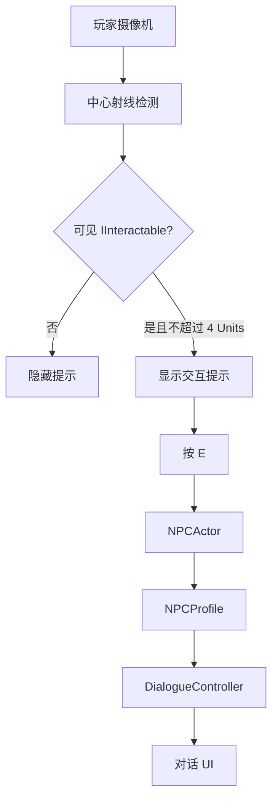
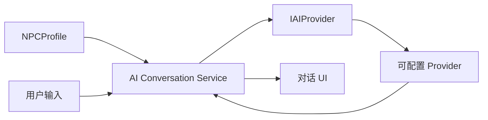

# AI 与 NPC 交互

[English](./AIAndNPC.md) | **简体中文**

## 概述

GenesisWorld v0.4.0 从一个完全本地的 NPC 交互闭环开始。Commit 15 将玩家目标检测、可编辑的 NPC 身份数据与可读对话 UI 连接起来，但不加入网络请求或外部 AI Provider。这样可以在接入服务商之前，先得到可测试且职责清晰的 Gameplay 边界。

## v0.4.0 目标

- 建立稳定的 NPC 领域模型与交互流程。
- 分离场景实体、Profile 数据、玩家输入与 UI 职责。
- 在后续 Commit 中建立与服务商无关的对话边界。
- 只有在抽象稳定后，才接入一个可配置 LLM Provider。

Commit 15 只完成前两项，因此它是 NPC 交互基础，不是 AI 驱动 NPC 系统。

## NPC 领域模型

一个 NPC 由持久化的编辑数据和场景实体共同表示：

- [`NPCProfile`](../Assets/Scripts/NPC/NPCProfile.cs) 保存稳定身份和本地对话数据。
- [`NPCActor`](../Assets/Scripts/NPC/NPCActor.cs) 将一个 Profile 绑定到场景 GameObject，并提供交互入口。

这种分离让后续 Prompt Context 或记忆可以独立演进，而不把场景组件变成数据容器或 Service Manager。

## NPCProfile

`NPCProfile` 使用 `ScriptableObject`，因为身份数据应当可复用、可在 Inspector 中编辑，并独立于场景实例。当前字段如下：

| 字段 | Guide NPC 的值 |
|---|---|
| NPC Id | `npc_guide_001` |
| Display Name | `Aren` |
| Role | `World Guide` |
| Description | A guide who studies the generated landscape. |
| Greeting | Welcome to GenesisWorld. This landscape is generated from a deterministic world seed. |

稳定 ID 由作者配置，不在运行时随机生成，以便后续存档与记忆系统识别同一个角色。

## NPCActor

`NPCActor` 实现交互契约，并以安全回退值暴露 Profile 数据。它不读取玩家输入、不渲染 UI，也不知道未来 AI Provider 的存在。场景中的 Guide NPC 使用项目自制胶囊占位模型、紧凑 Collider 和一次性地形贴地逻辑；它不进入 `EnvironmentSpawner`。

## IInteractable

[`IInteractable`](../Assets/Scripts/Interaction/IInteractable.cs) 是轻量公共契约，包含提示文本、目标 Transform、可交互状态和交互入口。它已足够支持当前 NPC，也能让后续门或可检查物体复用，而无需引入全局交互 Manager。

## 玩家交互流程

[`PlayerInteractionController`](../Assets/Scripts/Interaction/PlayerInteractionController.cs) 从第三人称摄像机中心发射射线，选择最近的可见 Collider，再通过 `IInteractable` 过滤，并按命中 Collider 表面计算距离。系统不会每帧在全场景搜索对象。

射线最多检测 12 Units 的可见几何，但只有目标距离不超过 4 Units 时才允许交互。本 Commit 采用组件/接口过滤，没有新增项目 Layer。

## 对话 UI

[`DialogueController`](../Assets/Scripts/UI/DialogueController.cs) 管理当前 NPC 和 UI 状态。基于 TMP 的 Canvas 包含交互提示，以及带 NPC 名称、消息和关闭提示的底部对话面板。`CanvasScaler` 使用 `Scale With Screen Size`，参考分辨率为 `1920 × 1080`。

## 输入状态

项目继续使用 Unity Input System。`E` 打开或关闭对话，`Escape` 关闭对话。对话打开时，`PlayerController.SetInputEnabled(false)` 忽略移动、冲刺和跳跃输入，但仍继续应用重力。第三人称摄像机保持可用，对话不依赖鼠标光标。关闭或禁用对话后会恢复玩家输入。

## 当前 Mock 对话

Commit 15 直接显示 `NPCProfile.Greeting`。本地 Greeting 让 Player → NPC → UI 闭环保持确定性、离线且易于验证，避免在基础交互尚未稳定时引入网络错误、凭据、延迟和服务商响应格式。

## 未来 AI Provider 层

后续目标边界如下：

`AI Conversation Service`、`IAIProvider` 与外部 Provider 是 Commit 16 和 Commit 17 的设计目标，在 Commit 15 中均未实现。

## 运行时验证

Unity `2022.3.62f3c1` Play Mode 验证覆盖摄像机目标检测、提示显示、距离拒绝、视角转开、本地对话、移动锁定/恢复、渲染材质支持状态与同种子世界重新生成。Seed `12345` 重新生成 `18` 棵树和 `12` 块岩石，签名稳定为 `2087925580`。运行时 C# Error、项目 Error 与 Warning 均为 0。

## 当前限制

- 只有一个手工放置的占位 NPC 和一句本地 Greeting。
- 没有玩家文本输入、分支对话或对话历史。
- 没有 Provider 接口、HTTP 请求、API Key 或外部 LLM。
- 没有寻路、日程、自主行为、语音、情绪、任务或记忆。
- 当前使用组件过滤；交互类型增多后再评估专用 Interactable Layer。
