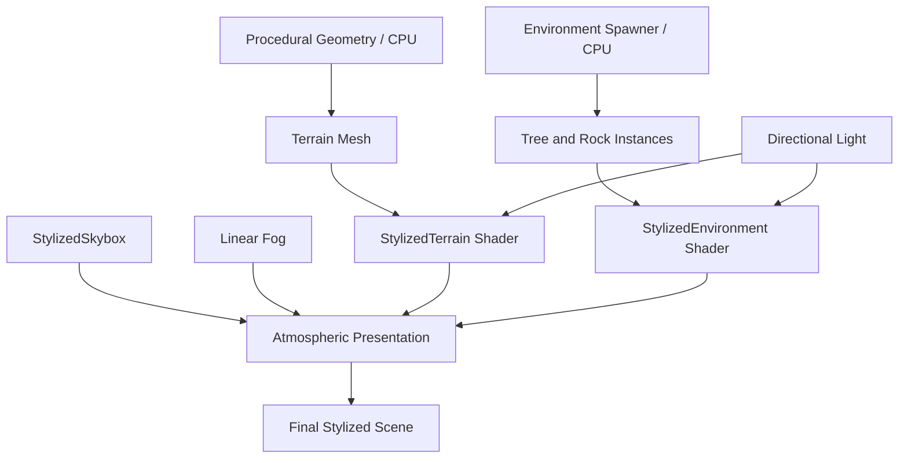
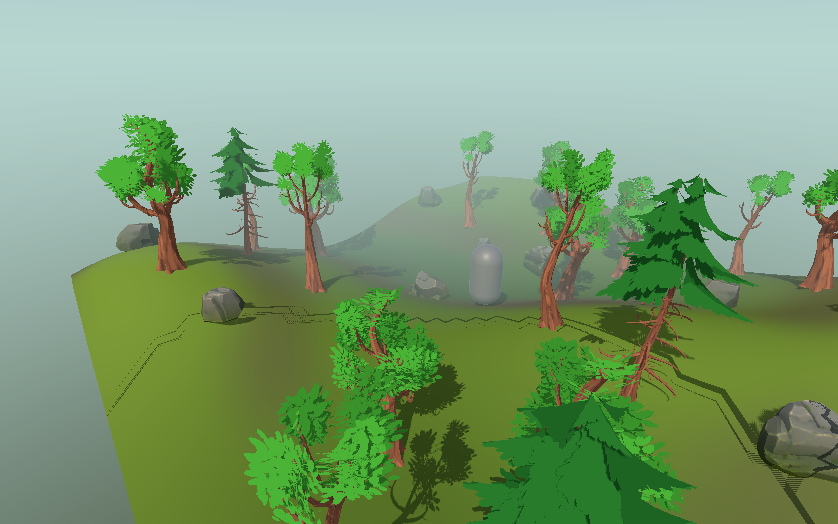

# v0.3.0 Rendering & Shader Milestone

**English** | [简体中文](./RenderingAndShaders_Milestone.zh-CN.md)

## Overview

v0.3.0 closes GenesisWorld's **Stylized Rendering Foundation**. The procedural world is now presented through three hand-written URP Shaders, coordinated directional lighting and shadows, and a lightweight sky/fog atmosphere. This is a graphics-learning milestone, not a complete or production-ready rendering engine.

## Goals

- Connect procedural geometry to an understandable GPU presentation pipeline.
- Learn world-space position, normals, dot products, diffuse lighting, light quantization, view direction, and fog through code used by the project.
- Give terrain and environment assets distinct Shader responsibilities while keeping one visual language.
- Document every implemented capability, limitation, and runtime validation result in English and Simplified Chinese.

## Rendering Architecture

GenesisWorld separates world construction from world presentation:

- **CPU World Generation:** `MeshGenerator`, `TerrainGenerator`, and `EnvironmentSpawner` create geometry, collision, deterministic placement, and lifecycle events.
- **GPU World Presentation:** `StylizedTerrain`, `StylizedEnvironment`, and `StylizedSkybox` calculate surface appearance, lighting, and atmosphere.



This boundary lets procedural algorithms change geometry without embedding rendering decisions in C#, while Shader changes do not alter the World Seed or placement stream.

## Commit Timeline

| Commit | Learning step | Technical purpose |
|---|---|---|
| 11 — Terrain Shader Foundation | **Surface** | Convert world height and slope into terrain color, then add main-light, shadow, and fog integration |
| 12 — Environment Lighting | **Environment** | Preserve source textures while applying wrapped, quantized lighting and alpha-aware depth/shadows |
| 13 — Atmospheric Rendering | **Whole Scene** | Unite terrain and assets with a gradient sky, horizon-matched fog, directional light, and controlled shadows |

The sequence moves deliberately from **Surface → Environment → Whole Scene**, so each graphics concept could be tested before the next layer was added.

## Stylized Terrain Shader

[`StylizedTerrain.shader`](../Assets/Shaders/Terrain/StylizedTerrain.shader) uses world-space height for low/high color blending and world-space normals for slope detection. It applies main directional Lambert lighting, scalar ambient fill, main-light shadow attenuation, and URP fog. It also reuses URP Lit `ShadowCaster` and `DepthOnly` passes.

```text
heightFactor = saturate((worldY - HeightMin) / max(HeightMax - HeightMin, 0.0001))
slope = 1 - saturate(dot(normalWS, WorldUp))
NdotL = saturate(dot(normalWS, lightDirectionWS))
```

## Stylized Environment Shader

[`StylizedEnvironment.shader`](../Assets/Shaders/Environment/StylizedEnvironment.shader) multiplies `_BaseMap` by `_BaseColor`, supports optional alpha clipping, and lights tree/rock facets with wrapped diffuse and configurable quantization. Its `ShadowCaster` and `DepthOnly` passes repeat the same alpha test, preserving foliage silhouettes in shadow and depth.

```text
wrapped = saturate((NdotL + LightWrap) / (1 + LightWrap))
banded = round(wrapped * (LightSteps - 1)) / (LightSteps - 1)
```

## Stylized Skybox

[`StylizedSkybox.shader`](../Assets/Shaders/Sky/StylizedSkybox.shader) converts the skybox cube direction into world space and uses normalized Y to blend Horizon Color toward Zenith Color or Lower Color. `Horizon Exponent` controls transition shape; the two gradients share one horizon color to avoid a seam.

## Atmospheric Rendering

The test scene uses Linear Fog from `12` to `40`. Fog Color and Skybox Horizon Color both use `(0.72, 0.84, 0.82)`, so distant surfaces approach their background instead of forming a gray boundary. This provides atmospheric depth for the small map without pretending it is infinite.

```text
FinalColor = lerp(SurfaceColor, FogColor, FogFactor)
```

## Lighting and Shadows

The scene uses one warm Directional Light at rotation `(48, -32, 0)` and intensity `1.15`. The selected High Fidelity URP profile uses Hard Shadows, a `2048` main-light shadow map, `40` shadow distance, two cascades, Bias `0.05`, Normal Bias `0.4`, and Near Plane `0.2`. Shadow distance matches fog end distance.

## Graphics Concepts Learned

| Concept | GenesisWorld implementation |
|---|---|
| Vertex | Procedural grid vertices are transformed to clip space in terrain rendering |
| World Position | Terrain `positionWS.y` drives elevation color |
| Normal | World-space normals drive terrain slope and environment facet readability |
| Dot Product | `dot(N, Up)` measures slope; `dot(N, L)` measures light-facing alignment |
| Lambert Lighting | Terrain uses saturated `N·L` for direct diffuse light |
| Light Quantization | Environment wrapped diffuse is rounded into configurable bands |
| View Direction | Skybox direction Y selects zenith, horizon, or lower gradient |
| Fog | URP `ComputeFogFactor` and `MixFog` blend compatible surfaces by distance |
| Atmospheric Depth | Matching fog and horizon colors creates a coherent distance cue |

## Key Technical Questions

- Why use world-space normals? They let slope and light calculations share stable scene directions.
- How does `N·L` work? It measures whether a surface faces the light.
- Why quantize lighting? A few stable bands make low-poly facets easier to read.
- Why match fog and horizon colors? Distant geometry can merge without a visible color discontinuity.
- Why separate terrain and environment Shaders? Generated ground needs height/slope color, while authored assets must preserve texture and alpha.
- Why separate CPU generation and GPU shading? Geometry and deterministic placement remain testable independently from presentation.

## Runtime Validation

Validated in Unity `2022.3.62f3c1`, URP `14.0.12`, using `Assets/Scenes/Test_Player_Controller.unity`:

- Terrain: `20 × 20`, `50 × 50` segments, Height Scale `5`
- Environment: `18` trees and `12` rocks
- Atmosphere: custom gradient skybox and Linear Fog `12–40`
- Rendering: terrain, environment, hard shadows, sky, and fog display without pink materials
- Determinism: Seed `12345` regenerated to layout signature `2087925580` before and after regeneration
- Project C# and Shader errors: `0`

## Screenshots


Ground-level final presentation with terrain, environment lighting, hard shadows, skybox, and fog.



Elevated view showing deterministic placement and distance depth. Historical screenshots remain in `Documentation/Images/` as an evolution record.

## Known Limitations

- Main directional light only; no custom Additional Lights loop
- No PBR material workflow in the custom terrain/environment Shaders
- No dynamic weather, day/night cycle, volumetric fog, clouds, water, or vegetation wind
- No screen-space effects or post-processing framework
- Smooth terrain vertex normals; no flat-terrain normal mode or triplanar textures
- Small single procedural map; no chunks, streaming, biome, or LOD system

## Design Decisions

- Hand-written compact HLSL keeps graphics fundamentals visible.
- Terrain and environment use separate Shaders because their source data and surface needs differ.
- Fog uses existing URP integration instead of a new runtime atmosphere manager.
- Hard shadows match the low-poly lighting language and tested more clearly than soft shadows at this scale.
- Existing real Unity captures are reused; no AI-generated image represents runtime output.

## Lessons Learned

- Surface color, direct light, shadow attenuation, and fog are easier to debug as separate stages.
- World space provides a shared frame for procedural geometry, slope, lighting, and sky direction.
- Alpha clipping must be consistent across forward, shadow, and depth passes.
- Small atmosphere changes can unify a scene without changing its generation system.
- Honest constraints make a graphics foundation more useful for future research and portfolio discussion.

## Next Phase

The roadmap continues with **v0.4.0 — AI NPC Interaction**. Optional future rendering studies—water, wind, Additional Lights, post processing, and LOD—remain separate possibilities and are not commitments in the v0.4.0 scope.
