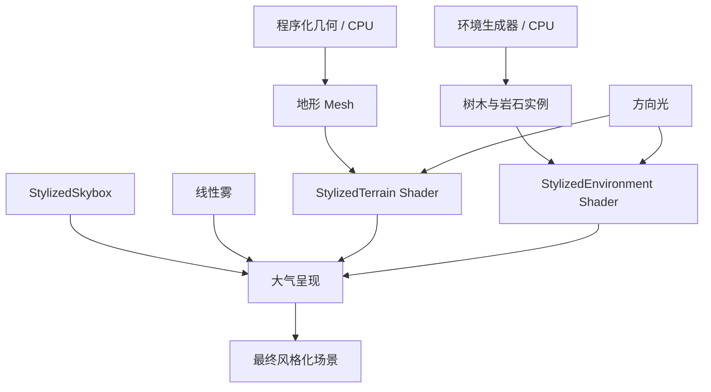

# v0.3.0 渲染与 Shader 里程碑

[English](./RenderingAndShaders_Milestone.md) | **简体中文**

## 概述

v0.3.0 完成 GenesisWorld 的**风格化渲染基础（Stylized Rendering Foundation）**。程序化世界现通过三个手写 URP Shader、统一的方向光与阴影，以及轻量天空/雾大气系统完成视觉呈现。这是图形学学习里程碑，不是完整或可直接用于生产的渲染引擎。

## 目标

- 将程序化几何连接到可理解的 GPU 表现流程。
- 通过项目真实代码学习世界位置、法线、点积、漫反射、光照量化、观察方向与雾。
- 让地形与环境资产拥有不同 Shader 职责，同时保持统一视觉语言。
- 用英文与简体中文准确记录全部已实现能力、限制和运行验证。

## 渲染架构

GenesisWorld 将世界构建与世界呈现分开：

- **CPU 世界生成：**`MeshGenerator`、`TerrainGenerator`、`EnvironmentSpawner` 负责几何、碰撞、确定性放置与生命周期事件。
- **GPU 世界呈现：**`StylizedTerrain`、`StylizedEnvironment`、`StylizedSkybox` 负责表面外观、光照与大气。



这个边界让程序化算法可以改变几何而不把渲染决策写进 C#；Shader 改动也不会改变 World Seed 或环境放置随机流。

## Commit 技术路线

| Commit | 学习步骤 | 技术目的 |
|---|---|---|
| 11 — 地形 Shader 基础 | **表面** | 将世界高度和坡度转为地形颜色，并接入主光、阴影与雾 |
| 12 — 环境光照 | **环境** | 保留源贴图，同时应用包裹式分层光照与支持透明裁剪的深度/阴影 |
| 13 — 大气渲染 | **完整场景** | 用渐变天空、地平线匹配雾、方向光与受控阴影统一地形和资产 |

路线按**表面 → 环境 → 完整场景**推进，使每个图形学概念都能在进入下一层前独立验证。

## 风格化地形 Shader

[`StylizedTerrain.shader`](../Assets/Shaders/Terrain/StylizedTerrain.shader) 使用世界空间高度混合高低颜色，并以世界空间法线检测坡度；随后应用主方向光 Lambert 光照、标量环境补光、主光阴影衰减和 URP Fog，同时复用 URP Lit 的 `ShadowCaster` 与 `DepthOnly` Pass。

```text
heightFactor = saturate((worldY - HeightMin) / max(HeightMax - HeightMin, 0.0001))
slope = 1 - saturate(dot(normalWS, WorldUp))
NdotL = saturate(dot(normalWS, lightDirectionWS))
```

## 风格化环境 Shader

[`StylizedEnvironment.shader`](../Assets/Shaders/Environment/StylizedEnvironment.shader) 将 `_BaseMap` 与 `_BaseColor` 相乘，支持可选透明裁剪，并通过包裹式漫反射与可调量化表现树木/岩石切面。`ShadowCaster` 和 `DepthOnly` Pass 重复相同 Alpha Test，使植被阴影与深度轮廓保持一致。

```text
wrapped = saturate((NdotL + LightWrap) / (1 + LightWrap))
banded = round(wrapped * (LightSteps - 1)) / (LightSteps - 1)
```

## 风格化天空盒

[`StylizedSkybox.shader`](../Assets/Shaders/Sky/StylizedSkybox.shader) 将天空盒立方体方向转换到世界空间，并依据归一化 Y 值从 Horizon Color 混合到 Zenith Color 或 Lower Color。`Horizon Exponent` 控制过渡形状；上下渐变共用同一地平线颜色，避免接缝。

## 大气渲染

测试场景使用 `12–40` Linear Fog。Fog Color 与 Skybox Horizon Color 均为 `(0.72, 0.84, 0.82)`，远处表面逐渐接近背景色，不形成灰色断层。它为小地图提供大气深度，但不会伪装成无限世界。

```text
FinalColor = lerp(SurfaceColor, FogColor, FogFactor)
```

## 光照与阴影

场景使用一盏暖色 Directional Light，Rotation 为 `(48, -32, 0)`，Intensity 为 `1.15`。选用的 High Fidelity URP 配置使用 Hard Shadows、`2048` 主光阴影贴图、`40` 阴影距离、两级 Cascade、Bias `0.05`、Normal Bias `0.4`、Near Plane `0.2`；阴影距离与雾结束距离一致。

## 已学习的图形学概念

| 概念 | GenesisWorld 中的对应实现 |
|---|---|
| Vertex | 程序化网格顶点在地形渲染时转换到裁剪空间 |
| World Position | 地形 `positionWS.y` 驱动高度颜色 |
| Normal | 世界空间法线用于地形坡度和环境切面可读性 |
| Dot Product | `dot(N, Up)` 衡量坡度；`dot(N, L)` 衡量朝向光源程度 |
| Lambert Lighting | 地形使用饱和后的 `N·L` 计算直接漫反射 |
| Light Quantization | 环境包裹式漫反射被取整为可配置明暗档位 |
| View Direction | 天空观察方向 Y 决定天顶、地平线或下半球渐变 |
| Fog | URP `ComputeFogFactor` 与 `MixFog` 按距离混合兼容表面 |
| Atmospheric Depth | 匹配雾色与地平线色，形成统一距离线索 |

## 关键技术问题

- 为什么使用世界空间法线？坡度和光照可以共享稳定的场景方向。
- `N·L` 如何工作？它衡量表面是否朝向光源。
- 为什么量化光照？少量稳定明暗档位能强化 Low-poly 切面。
- 为什么匹配雾色与地平线色？远景可融合且没有明显颜色断层。
- 为什么分离地形与环境 Shader？生成地面需要高度/坡度颜色，美术资产需要保留贴图与 Alpha。
- 为什么分离 CPU 生成与 GPU 着色？几何和确定性放置可以独立于表现进行测试。

## 运行验证

在 Unity `2022.3.62f3c1`、URP `14.0.12`、`Assets/Scenes/Test_Player_Controller.unity` 中验证：

- 地形：`20 × 20`，`50 × 50` 分段，Height Scale `5`
- 环境：`18` 棵树、`12` 块岩石
- 大气：自定义渐变天空盒与 `12–40` Linear Fog
- 渲染：地形、环境、硬阴影、天空与雾正常显示，无粉色材质
- 确定性：Seed `12345` 重生成前后的 Layout Signature 均为 `2087925580`
- 项目 C# 与 Shader Error：`0`

## 截图


包含地形、环境光照、硬阴影、天空盒与雾的最终地面视角。


展示确定性环境分布与距离层次。历史截图继续保留在 `Documentation/Images/`，作为项目演进记录。

## 当前限制

- 仅处理主方向光，没有自定义 Additional Lights 循环
- 自定义地形/环境 Shader 不包含 PBR 材质工作流
- 没有动态天气、昼夜循环、体积雾、云、水体或植被风动
- 没有屏幕空间效果或后处理框架
- 地形使用平滑顶点法线，没有 Flat Terrain Normal 或 Triplanar Texture
- 仅有小型单块程序化地图，没有 Chunk、Streaming、Biome 或 LOD

## 设计决策

- 使用紧凑手写 HLSL，使图形学基础保持可见。
- 地形与环境采用独立 Shader，因为二者源数据和表面需求不同。
- Fog 使用现有 URP 集成，不新增运行时 Atmosphere Manager。
- Hard Shadow 符合 Low-poly 光照语言，并在当前尺度下比 Soft Shadow 更清晰。
- 复用真实 Unity 截图，不用 AI 生成图冒充运行结果。

## 学习总结

- 将表面颜色、直接光、阴影衰减与雾拆开，更容易调试。
- 世界空间为程序化几何、坡度、光照和天空方向提供共同坐标系。
- Forward、Shadow、Depth Pass 的 Alpha Clip 必须保持一致。
- 小幅大气调整无需改变生成系统，也能统一完整场景。
- 诚实记录边界，能让渲染基础更适合后续研究与作品集讲解。

## 下一阶段

路线图下一阶段为 **v0.4.0 — AI NPC 交互**。水体、风动、Additional Lights、后处理与 LOD 可作为未来独立研究方向，但不是 v0.4.0 的承诺范围。
