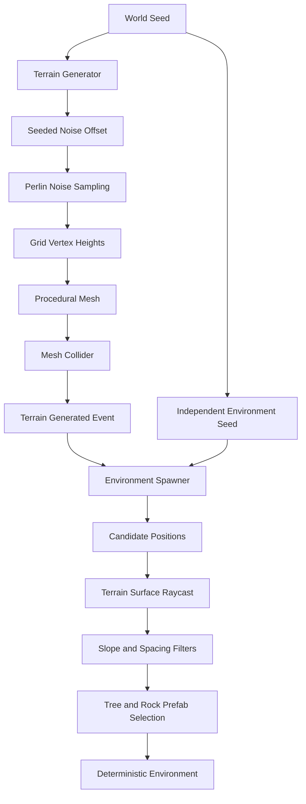
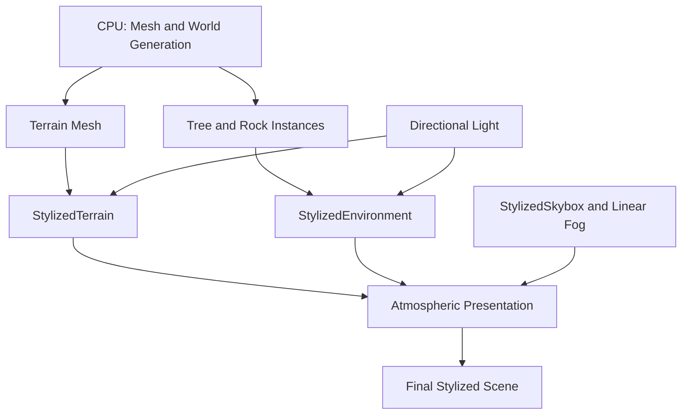

# GenesisWorld

**English** | [简体中文](./README.zh-CN.md)

> A Unity-based interactive virtual environment combining deterministic procedural generation with a custom stylized URP rendering foundation.

   

GenesisWorld explores how procedural generation, real-time graphics, and future generative AI systems can form an interactive virtual environment. **Current milestone: v0.3.0 — Rendering & Shader.** The project now has a Stylized Rendering Foundation; it is not a complete game, production rendering engine, or implemented AI product.

**Current development: v0.4.0 — AI NPC Interaction (in progress).** Commit 15 adds a basic NPC interaction and local dialogue foundation; no external AI provider is connected.

## Showcase


Ground-level Unity Game View using seed `12345`, custom terrain/environment/sky Shaders, Linear Fog, and hard directional shadows.

### Rendering Progress

| Stylized Terrain — Commit 11 | Stylized Environment — Commit 12 |
|---|---|
|  |  |

Commit 13 unified the surface and environment stages through sky, fog, light, and whole-scene presentation. Earlier captures remain in `Documentation/Images/` as an honest evolution record.

### NPC Interaction Foundation


Commit 15 introduces the profile-driven Guide NPC, camera-targeted interaction, a TMP dialogue panel, and safe player movement locking. Aren is a project-created placeholder used to validate the interaction architecture.

## Overview

GenesisWorld is an open-source Unity project for digital media technology study, portfolio presentation, and research-oriented experimentation. It emphasizes modular responsibilities, reproducible generation, documented asset provenance, and incremental milestones.

## Current Features

- CharacterController movement, sprinting, jumping, gravity, and ground detection
- Third-person camera with mouse orbit, pitch clamp, smoothing, and scroll zoom
- Procedural grid vertices, triangles, UVs, normals, and bounds
- Configurable Perlin-noise terrain height
- Deterministic world seeds without changing Unity's global random state
- Terrain Mesh lifecycle, MeshCollider updates, and a generation event
- Deterministic tree and rock spawning using raycasts, slope limits, and spacing
- Seeded prefab selection, rotation, and scale
- URP low-poly environment assets with simplified collision
- Custom URP Stylized Terrain Shader with shadow receiving and Fog compatibility
- Custom Stylized Environment Shader with quantized light bands and wrapped diffuse
- Texture-preserving `BaseMap` / `BaseColor`, alpha clipping, and alpha-aware foliage shadows
- Custom gradient skybox with zenith, horizon, lower color, and transition control
- Linear atmospheric fog with horizon-matched color
- Coordinated directional lighting, hard shadows, and ambient presentation
- ScriptableObject-based NPC identity data with a stable authored ID
- Camera-center `IInteractable` targeting with distance and visibility checks
- TMP interaction prompt and local profile-based dialogue
- Dialogue-safe player movement input lock and restore

`Same seed + same parameters + same assets = same procedural world`

## Procedural World Generation Pipeline



See [Procedural Terrain](Documentation/ProceduralTerrain.md) and [Procedural Environment](Documentation/ProceduralEnvironment.md).

## Rendering Pipeline



CPU systems own geometry and deterministic placement; GPU Shaders own surface appearance, lighting, and atmosphere. See [Rendering and Shaders](Documentation/RenderingAndShaders.md).

## Architecture

| Module | Responsibility |
|---|---|
| `MeshGenerator` | Grid geometry, triangles, UVs, and Perlin height sampling |
| `TerrainGenerator` | Parameters, seed offset, Mesh lifecycle, MeshCollider, and generation event |
| `EnvironmentSpawner` | Environment random stream, candidates, raycasts, filters, prefab variants, and regeneration |
| `PlayerController` | Input, movement, sprint, jump, and gravity |
| `CameraController` | Third-person follow, orbit, pitch clamp, smoothing, and zoom |
| `NPCProfile` / `NPCActor` | Authored NPC identity data and the scene interaction entity |
| `PlayerInteractionController` | Camera raycast targeting, range validation, and interact input |
| `DialogueController` | Prompt/dialogue presentation and player-input state |
| `StylizedTerrain` | GPU height/slope color blending and lightweight directional lighting |
| `StylizedEnvironment` | Texture-preserving banded lighting and alpha-aware environment shadows |
| `StylizedSkybox` | View-direction gradient sky and coordinated atmospheric horizon |

Terrain construction and environment placement are separate so each owns a clear lifecycle. Local `System.Random` instances provide reproducibility without contaminating `UnityEngine.Random`. See [Architecture](Documentation/Architecture.md).

## Controls

| Input | Action |
|---|---|
| WASD | Move relative to camera |
| Shift | Sprint |
| Space | Jump |
| Mouse movement | Orbit camera |
| Mouse wheel | Zoom |
| E | Talk to the targeted NPC / close dialogue |
| Escape | Close dialogue, otherwise release cursor |

## Technology Stack

- Unity `2022.3.62f3` LTS, C#, Universal Render Pipeline
- `Mathf.PerlinNoise`, local `System.Random`
- Git and GitHub

## Project Structure

```text
GenesisWorld/
├── Assets/{Art,Prefabs,Scenes,Scripts,Settings,ThirdParty}/
├── Documentation/
├── Packages/
├── ProjectSettings/
├── README.md
└── README.zh-CN.md
```

## Getting Started

1. Install Unity Hub and Unity `2022.3.62f3` LTS.
2. Run `git clone https://github.com/451411308-ctrl/GenesisWorld.git`.
3. Add the folder in Unity Hub and allow packages to restore.
4. Open `Assets/Scenes/Test_Player_Controller.unity`.
5. Enter Play Mode.

## Current Milestone

**v0.3.0 — Rendering & Shader Milestone**

The Stylized Rendering Foundation is complete: custom terrain, environment, and skybox Shaders; directional lighting; hard shadows; Linear Fog; and coordinated atmosphere. This does not mean rendering is complete forever. Read the [v0.3.0 milestone report](Documentation/RenderingAndShaders_Milestone.md).

## Development Roadmap

| Version | Phase | Status |
|---|---|---|
| v0.1.0 | Core Framework | ✅ Complete |
| v0.2.0 | Procedural World | ✅ Complete |
| v0.3.0 | Rendering & Shader | ✅ Complete |
| v0.4.0 | AI NPC Interaction | 🚧 In Progress |
| v0.5.0 | AIGC-assisted Content Pipeline | ⏳ Planned |

Biomes, chunks, infinite terrain, water, advanced shaders, AI NPCs, and runtime AIGC are roadmap items—not current features.

## Third-party Assets

The environment uses a curated subset of Quaternius's [Stylized Nature MegaKit](https://quaternius.com/packs/stylizednaturemegakit.html), released under CC0 1.0. See [Third-Party Assets](Documentation/ThirdPartyAssets.md).

## Documentation

- [Architecture](Documentation/Architecture.md) · [Project Configuration](Documentation/ProjectConfiguration.md)
- [Development Log](Documentation/DevelopmentLog.md) · [Roadmap](Documentation/Roadmap.md)
- [Week 1 Milestone](Documentation/Week1_Milestone.md) · [Procedural World Milestone](Documentation/ProceduralWorld_Milestone.md)
- [Rendering & Shader Milestone](Documentation/RenderingAndShaders_Milestone.md)
- [Procedural Terrain](Documentation/ProceduralTerrain.md) · [Procedural Environment](Documentation/ProceduralEnvironment.md)
- [Rendering and Shaders](Documentation/RenderingAndShaders.md)
- [AI and NPC Interaction](Documentation/AIAndNPC.md)
- [Third-Party Assets](Documentation/ThirdPartyAssets.md)

## License and Asset Licensing

No project-wide source-code license has been declared. Third-party assets retain their documented terms; the integrated Quaternius subset is CC0 1.0. The asset license does not imply a source-code license.
