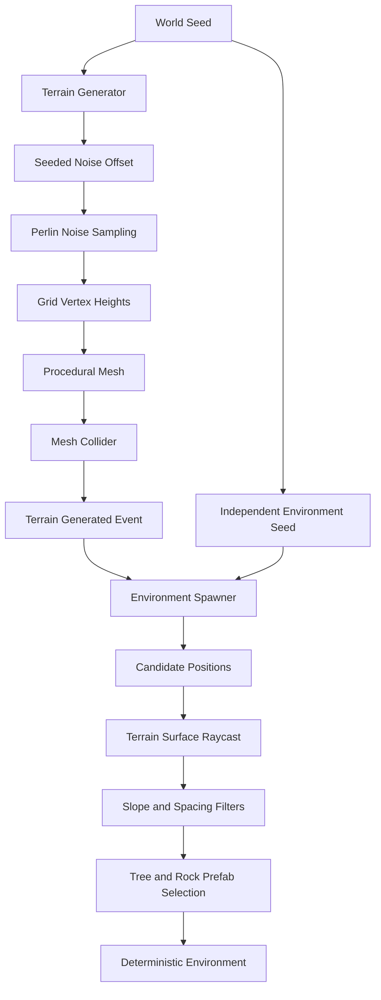

# GenesisWorld

**English** | [简体中文](./README.zh-CN.md)

> A Unity-based generative virtual world prototype featuring deterministic procedural terrain and environment generation.

   

GenesisWorld explores how procedural generation, real-time rendering, and future generative AI systems can be combined into an interactive virtual environment. The current release is a procedural-world foundation—not a complete game or an implemented AI product.

## Showcase


Ground-level Unity Game View using seed `12345`, a custom gradient skybox, linear fog, and hard directional shadows.


Elevated runtime view of the same deterministic world. Distant terrain, trees, and rocks blend toward the shared horizon/fog color.

### Rendering Progress


Commit 11 established terrain shading, Commit 12 extended the lighting language to environment assets, and Commit 13 unified both through sky, fog, light, and presentation. Earlier captures remain in `Documentation/Images/`.

## Overview

GenesisWorld is an open-source Unity project for digital media technology study, portfolio presentation, and research-oriented experimentation. It emphasizes modular responsibilities, reproducible generation, documented asset provenance, and incremental milestones.

## Current Features

- CharacterController movement, sprinting, jumping, gravity, and ground detection
- Third-person camera with mouse orbit, pitch clamp, smoothing, and scroll zoom
- Procedural grid vertices, triangles, UVs, normals, and bounds
- Configurable Perlin-noise terrain height
- Deterministic world seeds without changing Unity's global random state
- Terrain Mesh lifecycle, MeshCollider updates, and a generation event
- Deterministic tree and rock spawning using raycasts, slope limits, and spacing
- Seeded prefab selection, rotation, and scale
- URP low-poly environment assets with simplified collision
- Stylized terrain shading driven by world height, surface slope, and main directional light
- Stylized environment lighting with configurable light bands, texture-preserving color tint, alpha clipping, and hard shadows
- Custom gradient skybox and scale-matched linear fog with coordinated horizon color

`Same seed + same parameters + same assets = same procedural world`

## Procedural World Generation Pipeline



See [Procedural Terrain](Documentation/ProceduralTerrain.md) and [Procedural Environment](Documentation/ProceduralEnvironment.md).

## Architecture

| Module | Responsibility |
|---|---|
| `MeshGenerator` | Grid geometry, triangles, UVs, and Perlin height sampling |
| `TerrainGenerator` | Parameters, seed offset, Mesh lifecycle, MeshCollider, and generation event |
| `EnvironmentSpawner` | Environment random stream, candidates, raycasts, filters, prefab variants, and regeneration |
| `PlayerController` | Input, movement, sprint, jump, and gravity |
| `CameraController` | Third-person follow, orbit, pitch clamp, smoothing, and zoom |
| `StylizedTerrain` | GPU height/slope color blending and lightweight directional lighting |
| `StylizedEnvironment` | Texture-preserving banded lighting and alpha-aware environment shadows |
| `StylizedSkybox` | View-direction gradient sky and coordinated atmospheric horizon |

Terrain construction and environment placement are separate so each owns a clear lifecycle. Local `System.Random` instances provide reproducibility without contaminating `UnityEngine.Random`. See [Architecture](Documentation/Architecture.md).

## Controls

| Input | Action |
|---|---|
| WASD | Move relative to camera |
| Shift | Sprint |
| Space | Jump |
| Mouse movement | Orbit camera |
| Mouse wheel | Zoom |
| Escape | Release cursor |

## Technology Stack

- Unity `2022.3.62f3` LTS, C#, Universal Render Pipeline
- `Mathf.PerlinNoise`, local `System.Random`
- Git and GitHub

## Project Structure

```text
GenesisWorld/
├── Assets/{Art,Prefabs,Scenes,Scripts,Settings,ThirdParty}/
├── Documentation/
├── Packages/
├── ProjectSettings/
├── README.md
└── README.zh-CN.md
```

## Getting Started

1. Install Unity Hub and Unity `2022.3.62f3` LTS.
2. Run `git clone https://github.com/451411308-ctrl/GenesisWorld.git`.
3. Add the folder in Unity Hub and allow packages to restore.
4. Open `Assets/Scenes/Test_Player_Controller.unity`.
5. Enter Play Mode.

## Current Milestone

**v0.2.0 — Procedural World Milestone**

This milestone completes the procedural-world foundation: grid mesh, Perlin terrain, seeded reproducibility, environment placement, and low-poly asset integration. It is a foundation for later rendering, AI NPC, and AIGC work. Read the [milestone report](Documentation/ProceduralWorld_Milestone.md).

## Development Roadmap

| Version | Phase | Status |
|---|---|---|
| v0.1.0 | Core Framework | ✅ Complete |
| v0.2.0 | Procedural World | ✅ Complete |
| v0.3.0 | Rendering & Shader Development | 🚧 In Progress |
| v0.4.0 | AI NPC Interaction | ⏳ Planned |
| v0.5.0 | AIGC-assisted Content Pipeline | ⏳ Planned |

Biomes, chunks, infinite terrain, water, advanced shaders, AI NPCs, and runtime AIGC are roadmap items—not current features.

## Third-party Assets

The environment uses a curated subset of Quaternius's [Stylized Nature MegaKit](https://quaternius.com/packs/stylizednaturemegakit.html), released under CC0 1.0. See [Third-Party Assets](Documentation/ThirdPartyAssets.md).

## Documentation

- [Architecture](Documentation/Architecture.md) · [Project Configuration](Documentation/ProjectConfiguration.md)
- [Development Log](Documentation/DevelopmentLog.md) · [Roadmap](Documentation/Roadmap.md)
- [Week 1 Milestone](Documentation/Week1_Milestone.md) · [Procedural World Milestone](Documentation/ProceduralWorld_Milestone.md)
- [Procedural Terrain](Documentation/ProceduralTerrain.md) · [Procedural Environment](Documentation/ProceduralEnvironment.md)
- [Rendering and Shaders](Documentation/RenderingAndShaders.md)
- [Third-Party Assets](Documentation/ThirdPartyAssets.md)

## License and Asset Licensing

No project-wide source-code license has been declared. Third-party assets retain their documented terms; the integrated Quaternius subset is CC0 1.0. The asset license does not imply a source-code license.
