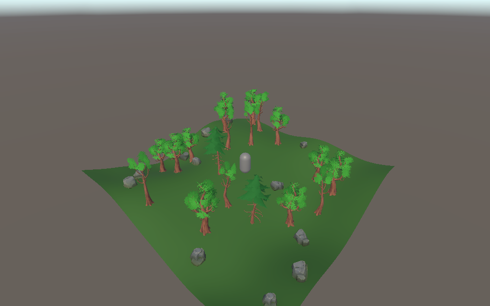

# GenesisWorld

**A Generative AI Driven Interactive Virtual Environment Based on Unity**

**基于 Unity 与生成式人工智能的智能交互虚拟环境**

## Overview / 项目概述

### English

GenesisWorld is a Unity-based interactive virtual environment project that explores the integration of:

- Procedural generation
- Real-time graphics
- Generative AI
- Intelligent interaction

The project is maintained as an undergraduate technical open-source project for digital media technology study, portfolio presentation, and future research-oriented development.

### 中文

GenesisWorld 是一个基于 Unity 开发的智能交互虚拟环境项目，主要探索以下技术方向的融合：

- 程序化内容生成
- 实时图形渲染
- 生成式人工智能
- 智能交互

项目按照本科生技术型开源项目标准持续维护，可用于数字媒体技术学习、项目展示，并为后续科研方向扩展提供基础。

## Features / 功能特性

### Completed / 已完成

**English**

- ✓ Unity project initialization
- ✓ Player controller system
- ✓ Third-person camera system
- ✓ Stylized low-poly environment integration

**中文**

- ✓ Unity 工程初始化
- ✓ 玩家控制系统
- ✓ 第三人称摄像机系统
- ✓ 风格化 Low-poly 环境资产集成

### In Progress / 开发中

**English**

- Procedural World Generation
  - Grid Mesh Foundation ✅
  - Noise-based Terrain ✅
  - Seeded World Generation ✅
  - Procedural Environment Spawning ✅
  - Low-poly Environment Integration ✅
  - Procedural World Milestone ⏳

Two tree variants and three rock variants are deterministically selected and placed on the generated terrain from the World Seed.

**中文**

- 程序化世界生成
  - 规则网格基础 ✅
  - 噪声地形生成 ✅
  - 确定性种子世界生成 ✅
  - 程序化环境物体生成 ✅
  - Low-poly 环境资产集成 ✅
  - 程序化世界里程碑 ⏳

系统会根据 World Seed 确定性选择并放置 2 种树木与 3 种岩石 Variant。

## Showcase / 项目展示

The screenshot is captured from the real Unity Game View using seed `1001`.

截图来自真实 Unity Game View，使用 World Seed `1001`。

### Planned / 计划功能

**English**

- Procedural world generation
- AI NPC interaction
- Shader-based rendering
- AIGC-assisted asset generation

**中文**

- 程序化世界生成
- AI NPC 智能交互
- 基于 Shader 的实时渲染
- AIGC 辅助游戏资产生成

## Technology Stack / 技术栈

| Category / 类别 | Technology / 技术 |
|---|---|
| Game Engine / 游戏引擎 | Unity 2022 LTS |
| Language / 开发语言 | C# |
| Rendering / 渲染 | Universal Render Pipeline (URP) |
| Version Control / 版本管理 | Git & GitHub |
| Future AI Integration / 后续 AI 集成 | LLM API / Generative AI |

## Current Version / 当前版本

**Version / 版本：** v0.1.0

**Milestone / 里程碑：**

Core Framework Completed

核心基础框架完成

## Development Roadmap / 开发路线

### Phase 1 — Core Framework / 核心框架

Completed / 已完成：

- Player Controller / 玩家控制
- Third-person Camera / 第三人称摄像机

### Phase 2 — Virtual Environment / 虚拟环境

Planned / 计划：

- Procedural World Generation / 程序化世界生成

### Phase 3 — Intelligent Interaction / 智能交互

Planned / 计划：

- AI NPC System / AI NPC 系统

### Phase 4 — Generative Content / 生成式内容

Planned / 计划：

- AIGC Asset Generation / AIGC 游戏资产生成

## Getting Started / 开始使用

### English

1. Install Unity Hub and Unity **2022.3.62f3 LTS**.
2. Clone this repository and open it through Unity Hub.
3. Allow Unity Package Manager to restore project dependencies.
4. Open `Assets/Scenes/Test_Player_Controller.unity`.
5. Enter Play Mode. Use WASD to move, Shift to sprint, Space to jump, the mouse to orbit, and the scroll wheel to zoom.

### 中文

1. 安装 Unity Hub 与 Unity **2022.3.62f3 LTS**。
2. 克隆本仓库，并通过 Unity Hub 打开工程。
3. 等待 Unity Package Manager 完成依赖恢复。
4. 打开 `Assets/Scenes/Test_Player_Controller.unity`。
5. 进入 Play Mode：使用 WASD 移动、Shift 冲刺、Space 跳跃、鼠标环绕观察，并通过滚轮缩放视角。

## Documentation / 项目文档

- [Architecture / 项目架构](Documentation/Architecture.md)
- [Project Configuration / 项目配置](Documentation/ProjectConfiguration.md)
- [Development Log / 开发日志](Documentation/DevelopmentLog.md)
- [Roadmap / 开发路线](Documentation/Roadmap.md)
- [Week 1 Milestone / 第一周里程碑](Documentation/Week1_Milestone.md)
- [Procedural Terrain Foundation / 程序化地形基础](Documentation/ProceduralTerrain.md)
- [Procedural Environment / 程序化环境生成](Documentation/ProceduralEnvironment.md)
- [Third-Party Assets / 第三方资源](Documentation/ThirdPartyAssets.md)

## Credits / 鸣谢

Selected environment models and textures are from the [Stylized Nature MegaKit](https://quaternius.com/packs/stylizednaturemegakit.html) by Quaternius, released under CC0 1.0. See [Third-Party Assets](Documentation/ThirdPartyAssets.md) for the exact files and modifications.

部分环境模型与贴图来自 Quaternius 的 [Stylized Nature MegaKit](https://quaternius.com/packs/stylizednaturemegakit.html)，采用 CC0 1.0 许可。具体文件与修改记录见 [第三方资源文档](Documentation/ThirdPartyAssets.md)。
