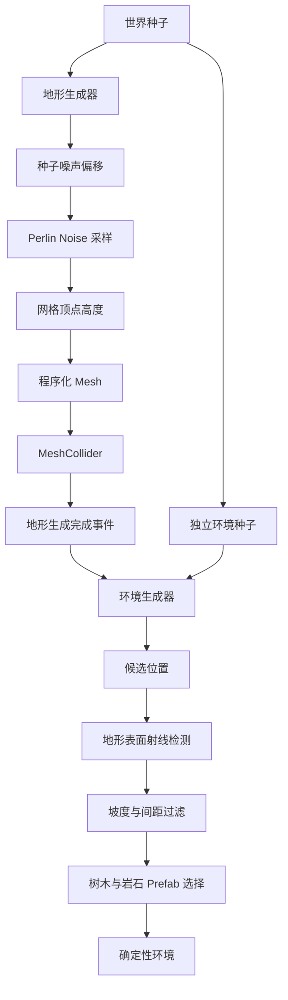

# GenesisWorld

[English](./README.md) | **简体中文**

> 基于 Unity 的生成式虚拟世界项目，目前已实现可复现的程序化地形与环境生成系统。

   

GenesisWorld 探索程序化生成、实时渲染与后续生成式 AI 系统如何组合成可交互虚拟环境。当前版本聚焦程序化世界基础，并非完整游戏，也尚未实现 AI 功能。

## 项目展示


地面附近真实 Unity Game View，Seed 为 `12345`，使用自定义渐变天空、线性雾与硬方向光阴影。


同一个确定性世界的高处运行视角；远处地形、树木与岩石逐渐混合到共享地平线/雾色。

### 渲染开发过程


Commit 11 建立地形着色，Commit 12 将光照语言扩展到环境资产，Commit 13 再通过天空、雾、光照与构图统一两者。更早截图继续保留在 `Documentation/Images/`。

## 项目概述

GenesisWorld 是面向数字媒体技术学习、作品集展示与研究探索的 Unity 开源项目，强调模块职责清晰、生成结果可复现、资产来源可追溯，以及按里程碑持续迭代。

## 当前功能

- CharacterController 移动、冲刺、跳跃、重力与地面检测
- 支持鼠标环绕、俯仰限制、平滑跟随和滚轮缩放的第三人称摄像机
- 程序化网格顶点、三角形、UV、法线与包围盒
- 参数化 Perlin Noise 地形高度
- 不污染 Unity 全局随机状态的确定性 World Seed
- Terrain Mesh 生命周期、MeshCollider 更新与生成事件
- 基于 Raycast、坡度限制和最小间距的树木与岩石生成
- 确定性的 Prefab 选择、旋转与缩放
- 使用 URP 材质和简化碰撞体的 Low-poly 环境资产
- 基于世界高度、表面坡度与主方向光的风格化地形 Shader
- 支持可调明暗分层、原贴图颜色、透明裁剪与硬阴影的风格化环境光照
- 自定义渐变天空与匹配场景尺度的线性雾，并统一地平线颜色

`相同种子 + 相同参数 + 相同资产 = 相同程序化世界`

## 程序化世界生成流程



实现细节见[程序化地形](Documentation/ProceduralTerrain.zh-CN.md)与[程序化环境](Documentation/ProceduralEnvironment.zh-CN.md)。

## 系统架构

| 模块 | 职责 |
|---|---|
| `MeshGenerator` | 网格几何、三角形、UV 与 Perlin 高度采样 |
| `TerrainGenerator` | 参数、种子偏移、Mesh 生命周期、MeshCollider 与生成事件 |
| `EnvironmentSpawner` | 环境随机流、候选点、射线检测、过滤、Prefab Variant 与重新生成 |
| `PlayerController` | 输入、移动、冲刺、跳跃与重力 |
| `CameraController` | 第三人称跟随、环绕、俯仰限制、平滑与缩放 |
| `StylizedTerrain` | GPU 高度/坡度颜色混合与轻量方向光照 |
| `StylizedEnvironment` | 保留贴图的分层光照与支持透明裁剪的环境阴影 |
| `StylizedSkybox` | 基于观察方向的渐变天空与协调大气地平线 |

地形构建与环境放置相互分离，使两个系统拥有清晰的生命周期。局部 `System.Random` 保证结果可复现，同时不影响 `UnityEngine.Random`。详见[架构文档](Documentation/Architecture.zh-CN.md)。

## 操作方式

| 输入 | 功能 |
|---|---|
| WASD | 相对摄像机移动 |
| Shift | 冲刺 |
| Space | 跳跃 |
| 鼠标移动 | 环绕摄像机 |
| 鼠标滚轮 | 缩放 |
| Escape | 释放光标 |

## 技术栈

- Unity `2022.3.62f3` LTS、C#、Universal Render Pipeline
- `Mathf.PerlinNoise`、局部 `System.Random`
- Git 与 GitHub

## 项目结构

```text
GenesisWorld/
├── Assets/{Art,Prefabs,Scenes,Scripts,Settings,ThirdParty}/
├── Documentation/
├── Packages/
├── ProjectSettings/
├── README.md
└── README.zh-CN.md
```

## 快速开始

1. 安装 Unity Hub 与 Unity `2022.3.62f3` LTS。
2. 执行 `git clone https://github.com/451411308-ctrl/GenesisWorld.git`。
3. 在 Unity Hub 添加工程并等待 Package 恢复。
4. 打开 `Assets/Scenes/Test_Player_Controller.unity`。
5. 进入 Play Mode。

## 当前里程碑

**v0.2.0 — 程序化世界里程碑**

本里程碑完成规则网格、Perlin 地形、种子复现、环境放置与 Low-poly 资产集成，为后续渲染、AI NPC 与 AIGC 研究提供基础。详见[里程碑报告](Documentation/ProceduralWorld_Milestone.zh-CN.md)。

## 开发路线

| 版本 | 阶段 | 状态 |
|---|---|---|
| v0.1.0 | 核心框架 | ✅ 已完成 |
| v0.2.0 | 程序化世界 | ✅ 已完成 |
| v0.3.0 | 渲染与 Shader 开发 | 🚧 进行中 |
| v0.4.0 | AI NPC 交互 | ⏳ 计划中 |
| v0.5.0 | AIGC 辅助内容流程 | ⏳ 计划中 |

Biome、Chunk、无限地形、水体、高级 Shader、AI NPC 与运行时 AIGC 均是未来规划，不是当前功能。

## 第三方资源

环境使用 Quaternius [Stylized Nature MegaKit](https://quaternius.com/packs/stylizednaturemegakit.html) 的精选子集，许可证为 CC0 1.0。详见[第三方资源](Documentation/ThirdPartyAssets.zh-CN.md)。

## 项目文档

- [系统架构](Documentation/Architecture.zh-CN.md) · [工程配置](Documentation/ProjectConfiguration.zh-CN.md)
- [开发日志](Documentation/DevelopmentLog.zh-CN.md) · [开发路线](Documentation/Roadmap.zh-CN.md)
- [第一周里程碑](Documentation/Week1_Milestone.zh-CN.md) · [程序化世界里程碑](Documentation/ProceduralWorld_Milestone.zh-CN.md)
- [程序化地形](Documentation/ProceduralTerrain.zh-CN.md) · [程序化环境](Documentation/ProceduralEnvironment.zh-CN.md)
- [渲染与 Shader](Documentation/RenderingAndShaders.zh-CN.md)
- [第三方资源](Documentation/ThirdPartyAssets.zh-CN.md)

## 许可证与资产声明

项目目前尚未声明覆盖源代码的整体许可证。第三方资产遵循各自记录的许可条款；已集成的 Quaternius 子集采用 CC0 1.0。资产许可证不等同于项目源代码许可证。
